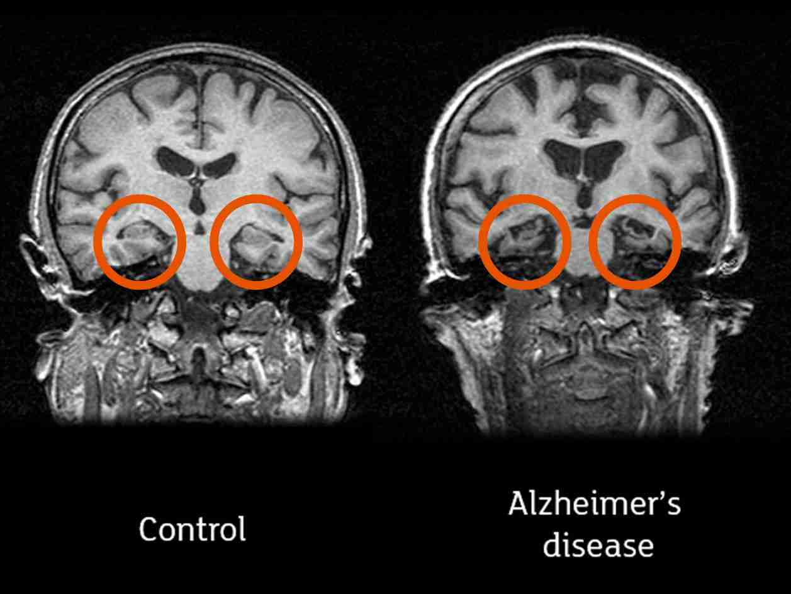
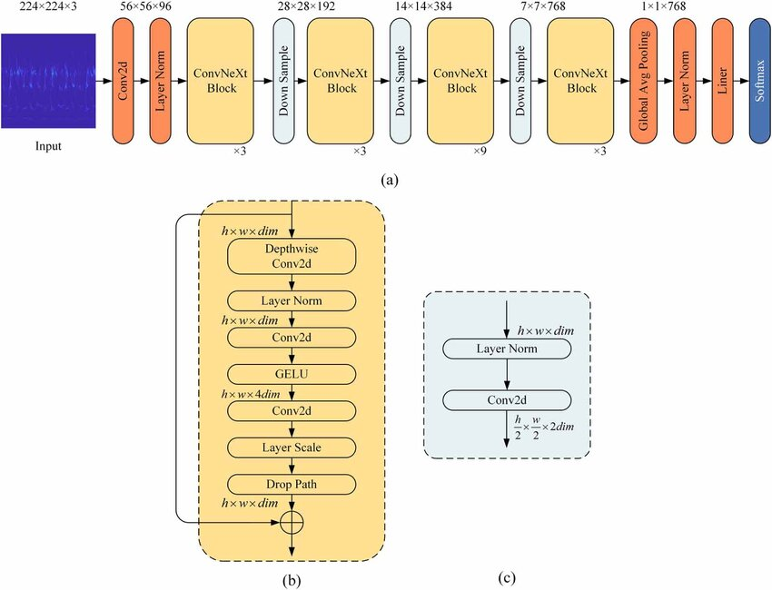
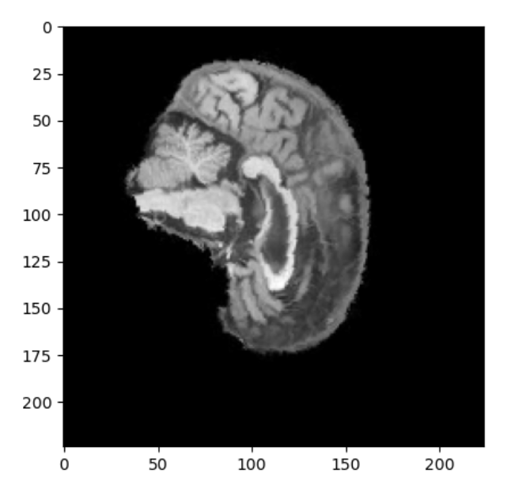
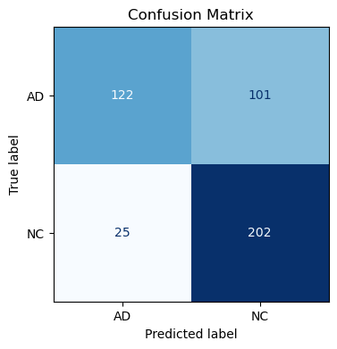
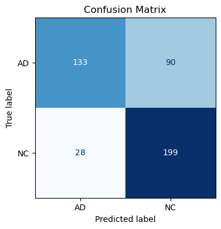
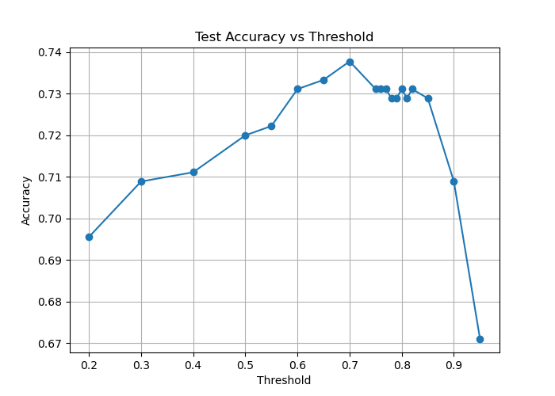
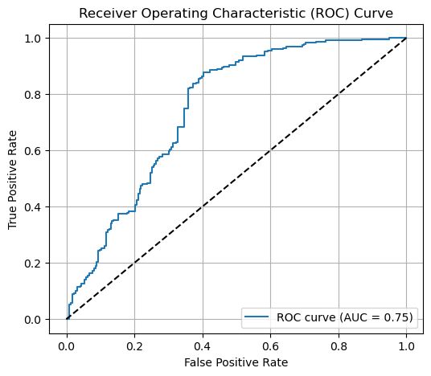
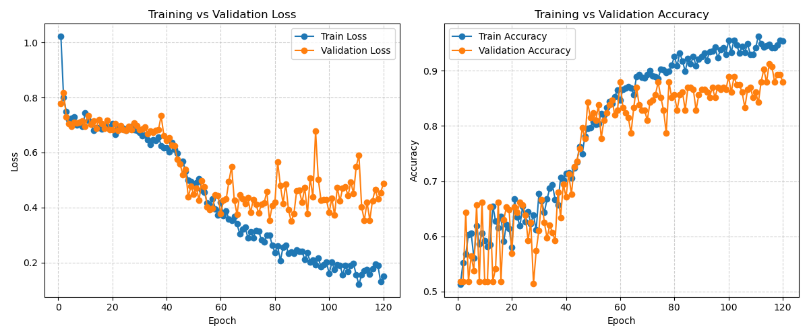

# Alzheimer's Disease (ADNI Dataset) Classification with ConvNeXt Model

**Student ID:** s4742538

**Name:** Ella Berglas

## Description of Algorithm and the problem that it solves
Alzheimer's is a degenerative brain disease in which the brain irreversably looses cells (and connections between neurons). This means the brain tissue becomes more spongy and shrinks. Brain MRI scans can be used to visualise and diagnose alzheimer's by professionals. 

An example image of how to identify alziemers is provided below.



*Images credit: Professor John O’Brien, University of Cambridge and Newcastle University* [1]

This project aims to successfully classify Alzhiemers Disease (AD) and Cognitive Normal (CN) brain scan segments with 80% accuracy using a ConvNeXt Model.

## Model Architecture
This project follows the architecture provided by the paper ConvNeXt models into the 2020s [3]. (Note this was considered acceptable as per ed post [\#296](https://edstem.org/au/courses/26755/discussion/3023908). 

A ConvNeXt builds apon a ResNet to match the performance of vision transformer models. [2] [3]
The models consists of two main types of layers: **downsampling** and **stages**.

The **downsampling** utilises layer normalisation and convolution with no overlap.
    Normalisation Layer : Normalises across the channels to stabelise activations before convolution
    2D Convolution (downsampling) : uses non-overlapping kernel size of 2 to downsample and increase channels
The stem (first downsampling layer) switches the convolusion and normalisation layer and utilises a smaller kernel and stride of 4. 

The **stages** is 4 layers of the block class. The block class consists of:
- 2D Convolustion with a  Conv (7×7) : captures spatial context efficiently with large kernel. Does not reduce size or change number of channels. 
- Permute: changes to channel_last format (N, H, W, C) for more efficient tensor operations.
- LayerNorm : normalises across channels for each "pixel" location.
- Linear: dense layer that 4x the channel size.
- GELU: weights the input by its probability under a gaussian (normal) distrubution.
- Linear: ÷4 the channel size.
- γ scaling parameter: a learned scalar multiplier for each channel. Helps stabilises early training.
- Permute back: changes to channel first (N, C, H, W).
- Add skip connection (input + x) : adds a skip connection (much like a resnet) from the block straight to the output. This helps reduce exploding gradients and helps the model learn.

The skip connection has been configures wiht a 0.2 dropout rate to help prevent overfitting. 

The model used is the "small" parameters:
```shell
    "in_chans": 20,
    "num_classes": 1,
    "depths": [3, 3, 27, 3],
    "dims": [96, 192, 384, 768],
    "drop_path_rate": 0.2
```
The full articture is as follows:

With the (N, C, H, W) format
- Input (16, 20, 224, 224)
- Downsampling (16, 96, 224/4, 224/4) (Stem): Conv 4×4 stride 4
- Stage 1 : 3 blocks sequentially
- Downsampling (16, 192, 224/8, 224/8)
- Stage 2 : 3 blocks sequentially
- Downsampling (16, 384, 224/16, 224/16)
- Stage 3 : 27 blocks sequentially
- Downsampling (16, 768, 224/32, 224/32)
- Stage 4 : 3 blocks sequentially
- Pool and Head (16, 2)

 [4]

a) is the full architecture, b) is the block / stages and c) is the downsampling. [4]


## ADNI Dataset
The dataset is split into training and testing data. It has been assumed that the images follow the format `<patient_id>_<segment_id>.jpeg`. Each patient has 20 brain segments (20 images each). 

Early experiments inputed one image at a time to the model a shape of (16, **1**, 224, 224). However, it is possible for an alzhiemers brain image segment to not have any signs of alzhiemers, and a model the model may have more context if the images were grouped on a per person basis (16, **20**, 224, 224). This also may closer allign with how humans diagnose alzhiemers based on the brain scans as they look at all images together to make an informed decision for that person. 

A validation set has also been produced from 20% of the training data. This validation set has been stratisfied to ensure the same proportions of classifications between the validation and training sets.This has also been conducted based on patient_id's to ensure no dataleekage between sets. Checks for this have been provided in the dataset.py.

Batch size was arbitrarily set to 16. 

```shell
The size of each set includes:
train size 860
val size 216
test size 9000
```

Note that this is the number of patients in each set.

To avoid overfitting, some randomised data transformations have been included for the training set. 
```
# a transform with different data transformations is used for better generalisation
train_transform = transforms.Compose([
    transforms.Resize((IMAGE_SIZE, IMAGE_SIZE)),
    transforms.Grayscale(num_output_channels=1),
    transforms.RandomAffine(degrees=10, translate=(0.05, 0.05), scale=(0.95, 1.05)),
    transforms.ColorJitter(brightness=0.15, contrast=0.15),  # change brightness and contrast
    transforms.ToTensor(),
    transforms.Normalize(mean=[NORMALISATION_M], std=[NORMALISATION_SD]),
    transforms.RandomErasing(p=0.1, scale=(0.02, 0.05))  # erases a small rectangle region
])
```
- **Random Affine** is may generalise better for the test set if the images are not the same scale, location and rotation.

- **ColourJitter** has been selected as brain scan images may have different brightnesses and contrasts.

- Finally, **Random Erasing** has been utilised to help with overfitting ansuring that the model investigates multiple aspects of the image. THis is only small and happens infrequently (10%)

The mean and standard deviation values for normalising the inputs are both 0.5. This enures the inputs and between -1 and 1. Normalisation values were calculates based on the training set (functions for this can be seen in the utils.py) and had a mean of 0.1114 and s.d of 0.2184. These values were correct, however, due to the image being predominantly black, these values are largely skewed to be lower than they should be. This means lighter pixels (white) had higher max values (~4 for these values) outside of the [-1, 1] range. 

The IMAGE_SIZE is 224, a standard input for the ConvNeXt model and matches the iamgenet dataset which is what the ConvNext model is designed for. [3]

The training and validation sets only utilise the resizing, normalisation, greyscale and tensor transformations to ensure suitability as input into the model. 

An example augmented input is provided below:




## Training
Training has been conducted on 120 epochs
```shell
LEARNING_RATE = 3e-4
WEIGHT_DECAY = 1e-3
EPOCHS = 120

weighted_penalty = torch.tensor([1.3], device=device)
criterion = nn.BCEWithLogitsLoss(pos_weight=weighted_penalty)
optimiser = optim.AdamW(model.parameters(), lr=LEARNING_RATE, weight_decay=WEIGHT_DECAY)
scheduler = torch.optim.lr_scheduler.CosineAnnealingWarmRestarts(optimiser, T_0=10, T_mult=2)
...
torch.nn.utils.clip_grad_norm_(model.parameters(), max_norm=1.0)

```


The **loss** function used is Binary Cross Entropy Loss, a standardly used loss function. BCE loss, unlike Cross Entropy Loss, outputs a single number between 0 and 1, with a number close to 0 indicating Alzhiemers and a number close to 1 indicating CN `{'AD': 0, 'NC': 1}`. Thi shas been chosen as it has more flexibility with the threshold between classes.

The **optimiser** updates the models weights based upon the gradients produced by the loss function (from loss.backward()). This also integrates weight decay, which is a regularisation technique that adds a decay factor to reduce the model weights at each step, encouraging the model to learn smaller weights preventing overfitting. [5]

The **schedular** changes the learning rate during training to follow a cosine that decays over time. The warm restarts means that the learning rate is reset every now and then, this helps escape local minimal and encourages exploraation. T_0=10 is the number of epochs before the first restart and T_mult=2 means that the next restart accurs half as frequently as the last. [6]

**Gradient clipping** limits the magnitude of the gradients (in this case 1) to prevent exploding gradients and stablise training. 

Initial results for the project resulted in AD having a high precision but low recall as well as an imbalanced confusion matrix:
```
[134  89
 18 209]
 ```

This suggested that when the model was unsure, it was more likly to predict cognitive normal rather than alzhiemers. This can be a good thing as the model seems to be identifying particular features for alzhiemers diagnosis. To increase accuracy and be more suited to a medical model (rather over diagnose than under), a larger penalty **weighted_penalty** has been provided for incorrecly guessing alzhiemers. This places more importance on under diagnosing. 

The best model is saved based upon the validation set accuracy. This should give a good estimate of the test set.

## Evaluation
The model achieved 73.78% accuracy on 68/100 epochs and took approximatly two hours to run on an nvidia 1650 laptop gpu with 4gb of ram (on a $600 laptop).

### Test Results
For medical diagnosis, it is often more important to over diagnose rather than under diagnose. Despite adding a weighted penalty during training a 0.5 threshold. As per the following confusion matrix, there is a very high false negative rate (predict CN when it is acutally AD)




This is supported by the classification report where AD has a very high precision, but low recall. This resulted in an accuracy of 0.72.
```shell
Classification Report:
              precision    recall  f1-score   support

          AD       0.83      0.55      0.66       223
          NC       0.67      0.89      0.76       227

    accuracy                           0.72       450
   macro avg       0.75      0.72      0.71       450
weighted avg       0.75      0.72      0.71       450
```

One way to counteract this is to add a higher threshold for NC results.

A threshold of 0.7 is used and has the following:



While still having a high fasle negative rate, this increased overall precision recall and accuracy statistics (with a minor decrease for NC recall).

This aided slightly in increasing the overall_accuracy to 73.78%. Increasing the threshold to 0.7 resulting in better predictions across multiple runs for training.

```
Classification Report:
              precision    recall  f1-score   support

          AD       0.83      0.60      0.69       223
          NC       0.69      0.88      0.77       227

    accuracy                           0.74       450
   macro avg       0.76      0.74      0.73       450
weighted avg       0.76      0.74      0.73       450
```

A graph of the threshold values and test accuracies has also been provided below.



It can be seen that the accuracy for the test set spikes arounf the 0.7 to 0.8 values for threshold. 

### Model Evaluation
#### ROC plot
ROC plots the true positive rate (correct AD predicitons) against the false positive rate (NC cases wrongly predicted as AD) for every classification threshold. 



an AUC value sof 0.75 means that the model can distiguish between the two classes approximatly 75% of the time. This means the model is doing resonably well and goes beyond random guessing (the dotted diagonal line).

#### Training
In this training example it can be seen that the validation accuracy and loss are rather similar until approximatly 70 epochs. After 70 epochs, the validation results stop improving but the training results do. This suggests that overfitting occurs after approximatly 70 epochs of training. 


It can also be noted that there is a growth in accuracy (and fall in loss) from epochs 40 to 60. This shows the model as the gradient falls into a local minima. 



Another thing to note is that the validation accuracy consistenly got into the 80% and sometimes 90% range. However, this is not consistent with the testing data. This suggests that the testing data might be somewhat different to the trainig data. This could include different brightnesses or orientations that stop the model from being able to generalise to it.  This may also suggest some overfitting in the model.

## Downfalls/ Improvements
A main challenge was to try and make a model that did not over or under fit and could generalise well to the training data. There was significant challenged with the model producing great results for the training and validation (wven when the validation data was not used at all in the training process) that may suggest somme significant differences betweent the provided training and testing data. 

Many other tenchiniques were trialled including: mixup (creating new training examples from blending existing ones), stronger augmentations, a sliding window of 3 images per entry (3 channels, 18ish entries per person) and various optimisers and scedulers. Each of these were not properly fine tuned and struggled with over and underfitting and dould not achieve higher accuracies than provided here. 

The model provided does result in some overfitting past ~ 70 epochs and falls into a local minima where it cannot achieve an accuracy grater than provided. Improvements could be made to generalise the model more and perhaps finetune and make stronger data augmentations. 

# Running the Code
To train the model run:
```shell
python train.py
```
This will produce a file ./model/alzhiemers_classification_model.pth. This will also produce a graph of the training and validation accuracy and loss for each epoch.

Then to predict run:
```shell
python predict.py
```
This will evaluate that model on 0.7 threshold. It will also produce 3 figures, confusion matrix, accuracy_thresholds and an ROC curve.

To change the MODEL_FILENAME (or any other parameters), edit and save the parameters file. 

## List of dependencies 
The conda environment was produced using:
```
conda create --name COMP3710_Project python=3.10
conda activate COMP3710_Project
conda install pytorch torchvision torchaudio pytorch-cuda=12.4 -c pytorch -c nvidia matplotlib
pip install timm
conda install scikit-learn
conda install -c anaconda Pillow
```

A file of all the installed dependenies used in the environment is contained in dependencies.txt.

## Reproducability
Due to randomness in the formation of the test data (during transformation), the results reported here are not guranteed to be reproducable, however, similar results have occurred on multiple runs of this code. 


# References
[1] 	E. Taylor, “All you need to know about brain scans and dementia,” Alzhiemers reasearch uk for a cure, 6 June 2022. [Online]. Available: https://www.alzheimersresearchuk.org/news/all-you-need-to-know-about-brain-scans-and-dementia/ . [Accessed 30 October 2025].
[2] 	Geeks for Geeks, “ConvNeXt,” Geeks for Geeks, 15 July 2025. [Online]. Available: https://www.geeksforgeeks.org/computer-vision/convnext/ . [Accessed 28 October 2025].
[3] 	2. H. M. C.-Y. W. C. F. T. D. S. X. Zhuang Liu1, “A ConvNet for the 2020s,” 1Facebook AI Research (FAIR) 2UC Berkeley, 2 March 2022. [Online]. Available: https://arxiv.org/pdf/2201.03545 https://github.com/facebookresearch/ConvNeXt. [Accessed 27 October 2025].
[4] 	H. F. Y. S. W. X. X. Z. Di Yu, “Deep transfer learning rolling bearing fault diagnosis method based on convolutional neural network feature fusion,” Research Gate, 9 October 2023. [Online]. Available: https://www.researchgate.net/publication/374280827_Deep_transfer_learning_rolling_bearing_fault_diagnosis_method_based_on_convolutional_neural_network_feature_fusion. [Accessed 30 October 2025].
[5] 	S. Mudadla, “Weight Decay in Deep Learning.,” Medium, 13 December 2023. [Online]. Available: https://medium.com/@sujathamudadla1213/weight-decay-in-deep-learning-8fb8b5dd825c . [Accessed 30 October 2025].
[6] 	Pytorch, “CosineAnnealingWarmRestarts,” Pytorch, [Online]. Available: https://docs.pytorch.org/docs/stable/generated/torch.optim.lr_scheduler.CosineAnnealingWarmRestarts.html . [Accessed 28 October 2025].

